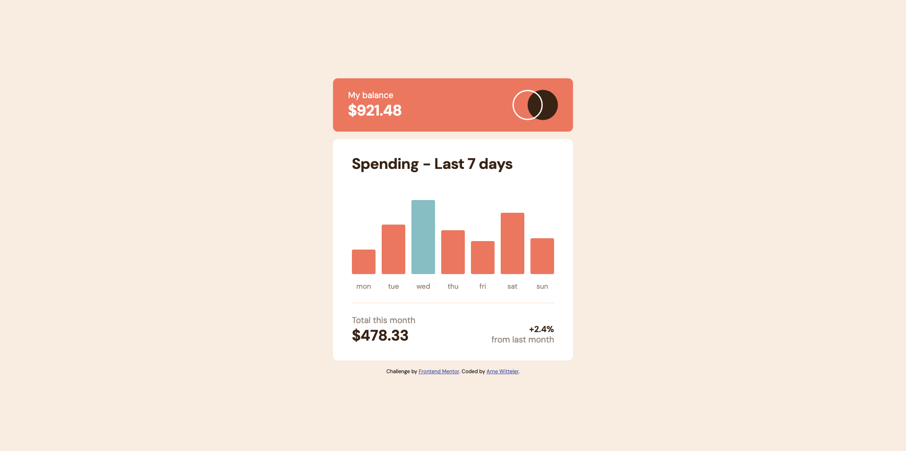

# Frontend Mentor - Expenses chart component solution

This is a solution to the [Expenses chart component challenge on Frontend Mentor](https://www.frontendmentor.io/challenges/expenses-chart-component-e7yJBUdjwt). Frontend Mentor challenges help you improve your coding skills by building realistic projects. 

## Table of contents

- [Frontend Mentor - Expenses chart component solution](#frontend-mentor---expenses-chart-component-solution)
  - [Table of contents](#table-of-contents)
  - [Overview](#overview)
    - [The challenge](#the-challenge)
    - [Screenshot](#screenshot)
    - [Links](#links)
  - [My process](#my-process)
    - [Built with](#built-with)
    - [What I learned](#what-i-learned)
    - [Continued development](#continued-development)
    - [AI Collaboration](#ai-collaboration)
  - [Author](#author)


## Overview

### The challenge

Users should be able to:

- View the bar chart and hover over the individual bars to see the correct amounts for each day
- See the current day’s bar highlighted in a different colour to the other bars
- View the optimal layout for the content depending on their device’s screen size
- See hover states for all interactive elements on the page
- **Bonus**: Use the JSON data file provided to dynamically size the bars on the chart

### Screenshot



### Links

- Solution URL: [Frontend mentor solution](https://github.com/arne-witteler/expenses-chart-component)
- Live Site URL: [Live demo](https://expenses-chart-component-five-brown.vercel.app)

## My process

### Built with

- Semantic HTML5 markup
- CSS custom properties
- Flexbox
- Mobile-first workflow
- Vanilla JavaScript
- Dynamic data from JSON

### What I learned

This project helped me practice working with external data sources and DOM manipulation. I dynamically loaded the chart data from a JSON file and used JavaScript to update the bar heights and display the spending amounts on hover.

Example of dynamically updating the bars:

```js
const updateBars = (key) => {
  const bars = document.querySelectorAll(".chart__bar");
  const highestAmount = Math.max(...expenses.map(expense => expense.amount));

  bars.forEach((bar, index) => {
    const amount = expenses[index][key];
    const percentage = amount * 3;
    bar.style.height = `${percentage}px`;
    bar.dataset.amount = amount;

    if (amount === highestAmount) {
      bar.classList.add("chart__bar--highest");
    }
  });
}
```

I also learned how to use CSS pseudo-elements with data attributes to create tooltips without additional JavaScript:

```css
.chart__bar::before {
  content: "$" attr(data-amount);
}
```

### Continued development

In future projects I would like to continue improving:
- Working with data-driven UI components
- Writing more efficient and reusable JavaScript functions
- Improving CSS architecture and responsive layouts

### AI Collaboration

AI tools (ChatGPT) were used during this project to:
- Debug JavaScript logic
- Improve code structure
- Explore different approaches for hover tooltips
- Optimize DOM manipulation and data handling

The AI was mainly used as a learning assistant and debugging partner, while the implementation and final structure were written manually.

## Author

- Frontend Mentor - [@arne-witteler](https://www.frontendmentor.io/profile/arne-witteler)
